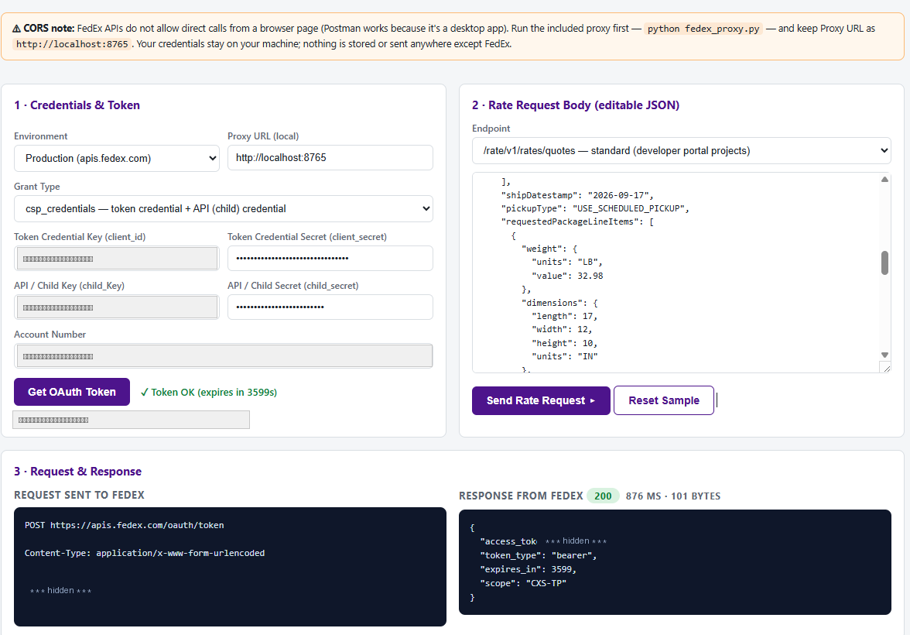
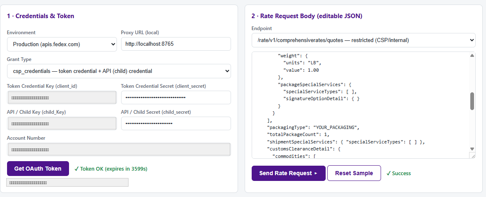
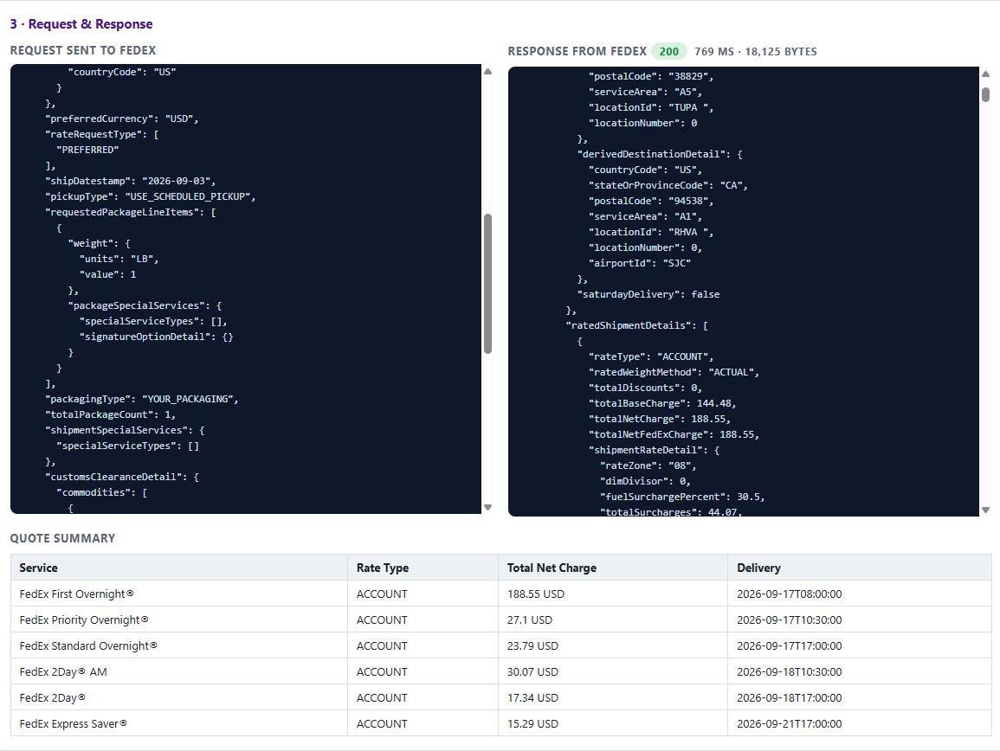

# FedEx Rate Quote Simulator

A lightweight, Postman-style tool for testing the **FedEx Rate API** — a single HTML file that runs in your browser. Enter your credentials, edit the JSON payload, hit send, and see the exact raw request and response side by side.

## Features

- **Sandbox & Production** — switch between `apis-sandbox.fedex.com` and `apis.fedex.com` with one dropdown
- **Both OAuth grant types** — `client_credentials` (standard projects) and `csp_credentials` (Compatible/Integrator with parent + child key pairs)
- **Both rate endpoints** — standard `/rate/v1/rates/quotes` and restricted `/rate/v1/comprehensiverates/quotes`
- **Raw request & response viewer** — exact HTTP traffic, status code, timing, and payload size; copy it into curl, Postman, or your own code to reproduce
- **Quote summary table** — each returned service with rate type, total net charge, and delivery commitment
- **Zero install** — one HTML file plus a tiny local proxy (PowerShell, built into Windows; or Python for macOS/Linux)
- **Private by design** — credentials never leave your machine; secrets and tokens are masked in all views; nothing is stored or logged

## Why the proxy?

Browsers enforce CORS, and FedEx APIs don't allow cross-origin calls from web pages (Postman isn't subject to CORS because it's a desktop app). The proxy runs on `http://localhost:8765`, forwards requests to FedEx, and adds the CORS headers on the way back. It listens on `127.0.0.1` only and forwards exclusively to FedEx hosts.

## Quick start

1. Clone or download this repository.
2. Start the proxy:
   - **Windows** — double-click `start-proxy.bat` (uses built-in PowerShell, nothing to install)
   - **macOS / Linux** — `python3 fedex_proxy.py`
3. Open `fedex-rate-quote-simulator.html` in your browser.
4. Enter your API credentials, get a token, and send a rate request.

## Getting FedEx credentials

1. Sign in at [developer.fedex.com](https://developer.fedex.com) and create a project that includes the **Rates and Transit Times API**.
2. The project page has two credential tabs: **Test key** (sandbox) and **Production key**.
3. Sandbox uses the **test account number** shown on your project page; production uses the real FedEx account number linked to your project.
4. Use grant type `client_credentials` unless FedEx issued your organization parent + child credential pairs (`csp_credentials`).

## A successful quote

## Troubleshooting

| Error | Meaning | Fix |
|---|---|---|
| `Failed to fetch` | Proxy not running | Start `start-proxy.bat` / `fedex_proxy.py`; check Proxy URL is `http://localhost:8765` |
| `401` | Token missing/expired | Get a new token (they last 1 hour) |
| `403 FORBIDDEN.ERROR` | Wrong environment for the key, API not in project, or restricted endpoint with a standard credential | Match key to environment; add the Rates API to your project; use `/rate/v1/rates/quotes` |
| `400 ACCOUNT.NUMBER.MISMATCH` | Account isn't the one registered to your keys, or payor/shipper/account don't match | Use the account linked to your project everywhere in the payload |
| `503` (sandbox) | Usually the sandbox rejecting a payload feature, not an outage | Strip to a minimal payload, add fields back in groups (SmartPost and customs blocks are frequent offenders) |

## Security notes

- Never commit or share your API keys, secrets, or account numbers.
- The proxy is localhost-only and cannot be reached from the network.
- Rate quoting is read-only — this tool cannot create shipments, labels, or charges.

## License

[MIT](LICENSE)

## Disclaimer

FedEx and SmartPost are trademarks of Federal Express Corporation. This is an independent testing utility, not affiliated with or endorsed by FedEx. See [developer.fedex.com](https://developer.fedex.com) for official API documentation and terms of use.
